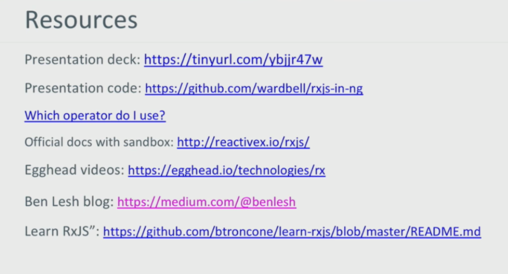
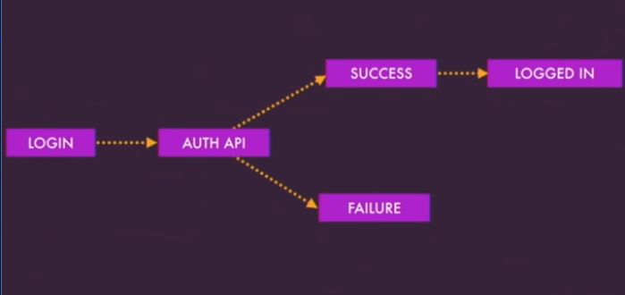

# Red

## fix the scss inspect in angular cli 6 (issues: 9099)

### Global level scss

1 modify angular.json to add --extract-css, in 6.0 this argument is removed from ng serve

```json
// angular.json
 "build": {
          "builder": "@angular-devkit/build-angular:browser",
          "options": {
           ---
          },
          "configurations": {
            "production": {
              ---
            },
            "serve": {
              "extractCss": true,
               ---
            }
          }
        },
```

2. then change serve->options->browserTarget->project-name:build to project-name:build:serve

```json
"serve": {
          "builder": "@angular-devkit/build-angular:dev-server",
          "options": {
            "open": true,
            "browserTarget": "<project-name>:build:serve"
          },
          "configurations": {
            "production": {
              ---
            }
          }
        }
```

3. run : ng serve --source-map


### Component level Scss

> You can temporarily fix this yourself editing changing the sourcemap option for both instances of postcss-loader in the following file
`./node_modules/@angular-devkit/build-angular/src/angular-cli-files/models/webpack-configs/styles.js` change `sourceMap: cssSourceMap` to `sourceMap: cssSourceMap ? 'inline' : false`

```ts
// line (201)
const rules = baseRules.map(({ test, use }) => ({
        exclude: globalStylePaths, test, use: [
            { loader: 'raw-loader' },
            {
                loader: 'postcss-loader',
                options: {
                    ident: 'embedded',
                    plugins: postcssPluginCreator,
                    sourceMap: cssSourceMap ? 'inline' : false
                }

```


## config the project structure

1. move everything fo appModule to a new directory `appModule` then change the path of app.module.ts

```ts
// main.ts

import { enableProdMode } from '@angular/core';
import { platformBrowserDynamic } from '@angular/platform-browser-dynamic';

import { AppModule } from './app/appModule/app.module';
import { environment } from './environments/environment';

if (environment.production) {
  enableProdMode();
}

platformBrowserDynamic().bootstrapModule(AppModule)
  .catch(err => console.log(err));

```


## integrate jquery and jquery plugin

1. integrate jquery

* jquery install

```bash
# install jquery
npm install -s jquery
# install @types/jquery
npm install --save-dev @types/jquery
```

* to import jquery in the angular.json file

> No need to configure angular.json any more. `But we still need to configure tsconfig.json currently`.
Import echarts theme files or other extension files in main.ts.  
> in  angular 6 we can straight to import file in component, and no need to import in angular.json

```js
// in angular.json 中
"scripts": [
  // "node_modules/jquery/dist/jquery.js",
],

```

* to config jquery types in `src/tsconfig.app.json`

```js
"compilerOptions": {
    "types": [
      "jquery"
    ]
  },

```
2. tsconfig.json: You need to map the jquery path to minified version of jquery in the compilerOptions of "tsconfig.json" in your project's root (this is important for AoT build):

```bash
{
  ...,
  "compilerOptions": {
    ...,
+    "paths": {
+      "echarts": ["node_modules/echarts/dist/jquery.min.js"]
+    }
  }
}
```

2. integrate jquery plugin

* Install the jquery plugin

```bash
npm install jquery-modal -s
```

* to import jquery in the `angular.json` file

```js
"scripts": [
  "node_modules/jquery/dist/jquery.js",
  "node_modules/jquery-modal/jquery.modal.min.js"
],

```

* Config the plugin declaration types

> if the typing.d.ts file is not exist, we have to touch one

```js
// in src/typing.d.ts 中

declare var module: NodeModule;
interface NodeModule {
  id: string;
}

interface JQuery {
  modal(options?:any, callback?:Function):any;
}
```

3. use the plugin in the component

> both the jquery and plugin have to be imported at start, or there will be no jquery object and jquery.model() method

```ts
import { Component, AfterViewInit } from '@angular/core';

// import jquery when we want to use in the component
import * as $ from 'jquery';
// import the jquery plugin , when we want to use plugin in the component

import 'jquery-modal';


@Component({
  selector: 'app-root',
  templateUrl: './app.component.html',
  styleUrls: ['./app.component.scss']
})
export class AppComponent implements AfterViewInit{
  title = 'red';

  ngAfterViewInit() {
    $('div').attr('style', 'background: red;');
    $('#login-form').modal();
  }
}


```

## ng add

### use ng add to integrate @angular/material

1. `ng add` 

```bash

ng add @angular/material
```


2. use ng add to custom our schematics

> https://blog.kevinyang.net/2018/06/15/angular-schematics-ng-add/

## integrate ngrx/platform

1. repo : https://github.com/ngrx/platform

2. bash

```bash
npm install -s @ngrx/store @ngrx/effects @ngrx/router-store @ngrx/store-devtools @ngrx/entity @ngrx/schematics

```


## integrate echarts

1. install  (v4.0)

```bash
npm install echarts -S
npm install ngx-echarts -S
npm install @types/echarts -D

# or if you use yarn
yarn add echarts
yarn add ngx-echarts
yarn add @types/echarts -D

```

2. tsconfig.json: You need to map the echarts path to minified version of echarts in the compilerOptions of "tsconfig.json" in your project's root (this is important for AoT build):

```bash
{
  ...,
  "compilerOptions": {
    ...,
     "paths": {
       "echarts": ["node_modules/echarts/dist/echarts.min.js"]
     }
  }
}
```

## lazyloading module 404 router config 

1. the router config of lazyloading component 
> https://stackoverflow.com/questions/39713864/404-pages-and-lazy-loading-in-angular2

* In the router module
```ts

const routes: Routes = [
  {
    path: 'notfound',
    loadChildren: '../notfound/notfound.module#NotfoundModule',
  },
  {
    path: '**', redirectTo: '/notfound'
  }
];

```

* In the notfound module
```ts
const routes: Routes = [
  { path: '', component: formContainers.NotfoundComponent },
];
```

* In the lazyloading module
```ts
const routes: Routes = [
  {
    path: 'home',
    component: fromContainers.HomeComponent,
  },
  // the '' is in the last
  { path: '', pathMatch: 'full', redirectTo: 'home' },
];

```


2. the 404 status of not found page
> https://blog.thecodecampus.de/angular-universal-handle-404-set-status-codes/

## Ngrx : How to share store among modules (main module / feature module)

> every module has its own state branch, the component in the lazyloading module can easily select it's own branch state, But have can we select random state branch in the entire state tree

> we can create a watcher services which watcher the state branch of the module that we want to select, then when the branch change we can receive the notice given by the watcher service in the lazyloading module. That's great !

## rxjs

1. custom pipeable operators

```js
const pow = (p: number) => (source: Observable<number>) => source.pipe(map => n ** p);
// or 
const pow = (p: number) => {
  return ( source : Observable<number> ) => {
    return source.pipe(map = >n ** p)
  }
}

```

```js
source$.pipe(
  filter( x => x> 100),
  pow(3)
).subscribe( x => console.log(x) );

```

2. New Feature in 6.0

* New unhandled error behavior
  + Old and Busted: If an observable errors with no error handler  ... rethrow the error `synchronously`
  + New Hotness: If an observable errors with no error handler  ... rethrow the error `asynchronously`

  `badSource$.subscribe(nextFn, handleError, completeFn)`

* the rethrow the error `synchronously` could cause a bug

> https://stackblitz.com/edit/angular-rxjs-prod-interference-tyxcce?file=app/app.component.ts

```ts
import { Component, Injectable } from '@angular/core';
import { interval } from 'rxjs/observable/interval';
import { share, map, filter } from 'rxjs/operators';

@Injectable()
export class JeffCrossService {
  private _source$ = interval(100).pipe(
    map(() => Math.round(Math.random() * 100)),
    share()
  );

  getAmazingStuff() {
    return this._source$;
  }
}

@Component({
  selector: 'misko-comp',
  template: '<div>Misko: {{display$ | async}}</div>',
})
export class MiskoComponent<T> {
  display$ = this.service.getAmazingStuff().pipe(
    filter(value => value > 50)
  )
  
  constructor(private service: JeffCrossService) {}
}

@Component({
  selector: 'ladyleet-comp',
  template: '<div>{{display$ | async}}</div>',
})
export class LadyLeetComponent<T> {
  display$ = this.service.getAmazingStuff().pipe(
    filter(value => value < 50)
  )
  
  constructor(private service: JeffCrossService) {}
}

@Component({
  selector: 'shai-comp',
  template: '<div>{{display$ | async}}</div>',
})
export class ShaiComponent<T> {
  display$ = this.service.getAmazingStuff().pipe(
    filter(value => {
      if (value === 42) throw Error('haha');
      return true;
    })
  )
  
  constructor(private service: JeffCrossService) {}
}


@Component({
  selector: 'my-app',
  templateUrl: './app.component.html',
  styleUrls: [ './app.component.css' ]
})
export class AppComponent  {
  name = 'Angular 5';
}
```

  + What happended ?
    - JeffCrossService.getAmazingStuff() returns a shared (multicast) Observable
    - Multicasting loops over an array of Observers and notifies them all using a for-loop.
    - ShaiComponent synchronously throws an error if JeffCrossService emits the number 42.
    - if the synchronous error is unhandled , RxJS synchronously re-throws it. (If the synchronous error goes all the way down i the chain of observation and is unhandled or there is no error handler then it will be synchronously thrown)
    - which means javaScript unwinds the callstack looking for a try/catch to handle the error
    - This breaks the for-loop for the multicast and stops notifying observers
    - Misko is sad and doesn't get his data updates
  > Imaging if different teams developed these components and a separate team develop the service like figuring ot who is to blame for this problem it's a very very nasty bug to run across, unless you happen to have me working with you . 

  + xjs 6 Solves this by scheduling the rethrwn 
  
 

* simplified imports

  +  we will import everything that's a type or scheduler or a helper from 'rxjs', and all of the operators get imported from 'rxjs/operators' 
    - rxjs
     + Types: Observable, Subject, BehaviorSubject, etc.
     + Creation methods: fromEvent, timer, interval, delay, concat, etc.
     + Schedulers: asapScheduler, asyncScheduler, etc.
     + Helpers: `pipe`, noop, identity, etc
    
    - rxjs/operators
      + All operators: map, mergeMap, takeUtil, scan, and so on.

  ```ts
  import { interval, of } from 'rxjs';
  import { filter, mergeMap, scan } from 'rxjs/operators';

  interval(1000).pipe(
    filter(x => x % 2 === 0).
    mergeMap( x => of(x+1, x+2, x+3) ),
    scan(s, x) => s+x, 0),
  ).subscribe(x => console.log(x));

  ```

  + An exhaustive list of v6 import sites
    - rxjs
    - rxjs/operators
    - rxjs/testing
    - rxjs/websocket
    - rxjs/ajax 

* Deprecations (and removals)

  + the reason one : To many way to do the same thing 

  ```ts
  // these are all ways to do basically what observable `of` does 
  import { ArrayObservable } from 'rxjs/observable/ArrayObservable';
  import { ScalarObservable } from 'rxjs/observable/ScalarObservable';
  import { fromArray } from 'rxjs/observable/fromArray';
  import { of } from 'rxjs/observable/of';
  import { Observable } from 'rxjs/observable/Observable';
  import 'rxjs/add/observable/of';

  Observable.of('foo');
  of('fo');
  fromArray(['foo']);
  new ScalarObservable('foo');
  ScalarObservable.create('foo');
  new ArrayObservable(['foo']);
  ArrayObservable.create(['foo']);
  
  ```

  + V6 there is one way to use something

  ```ts
  import { of } from 'rxjs';

  of('foo');
  
  ```

  + deprecate operators
    - concat
    - merge
    - zip
    - combineLatest

* a new operator

  + throwIfEmpty
    -  if the observable completes without emitting any values, will throw a error down the chain of observation.
    - id the observable emits even one value, the operator has no effect and is a pass-through

  + example

  > take all the button clicks until someone resizes the view and if no one clicks the button before the viewResize that said the error

  ```ts
  const mustClick$ = buttonClick$.pipe(
    takeUntil(this.viewResize$),
    throwIfEmpty(
      () = new Error(' user did not click before resize  ')
    )
  )
  
  ```

3. migration from rxjs 5 (important)

> https://www.youtube.com/watch?v=JCXZhe6KsxQ

* install rxjs-compat

```bash
# rxjs-compat provides a bridge to all of the old import and old types that existed in rxjs.5 
npm install rxjs-compat

```

* ng update rxjs : install the latest rxjs and rxjs-compat

* tslint to the rescue

    + install rxjs-tslint

    ```bash
    npm install rxjs-tslint

    # run tslint -fix (maybe more than once)

    > ./node_modules/.bin/tslint -c migrate.tslint.json  --project src/tsconfig.app.json --fix

    ```
    + create a migrate.tslint.json

    ```json
    {
      "ruleDirectory ": ["node_module/rxjs-tslint"],
      "rules": {
        "update-rxjs-imports": true,
        "migrate-to-pipeable-operators": true,
        "collapse-rxjs-imports": true
      }
    }
    
    ```

    + run tslint fix (maybe more than once)

    ```bash

    > ./node_modules/.bin/tslint -c migrate.tslint.json  --project src/tsconfig.app.json --fix

    ```

    + after `ng serve`  we can remove the rxjs-compat package

    


## custom our own module

1. Typescript component selector should be named undefined

* If you are using angular-cli try to add your own prefix to the angular-cli.json:

```bash
  apps: [
    {  ..., "prefix": "swiftlog"}
  ]
```

2. also change your tslint config:

```bash
"component-selector": [true, "element", "swiftlog", "kebab-case"],

```


## mock data 

> on the component develop process , we have to request some  data Apis , instead of node serve , we can use the mock service ; this is the necessary to develop the base template; 

### json-server

1. install 

```ts
 var db = {};
  var files = fs.readdirSync(jsonfolder);
  files.forEach(function (file) {
      if (path.extname(jsonfolder + file) === '.json') {
          db[path.basename(jsonfolder + file, '.json')] = require(path.join(jsonfolder,file));
      }
  });
  // Returns an Express server
  var server = jsonServer.create();
  // Set default middlewares (logger, static, cors and no-cache)
  server.use(jsonServer.defaults());
  // Returns an Express router
  var router = jsonServer.router(db);
  server.use(router);
  server.listen(port);

```

### @delon/mock alibaba

1. install the @delon/mock

```bash
npm install mockjs@1.0.1-beta3 -D -s
npm install @types/mockjs@1.0.0 -D -s
npm install @delon/mock@1.3.3 -D -s
npm install date-fns -D -s
```


```ts
 // in the component
 this.http.get('/api/list', { count: this.q.ps }).subscribe((res: any) => {
    this.list = res.map(item => {
      item.activeUser = this.formatWan(item.activeUser);
      return item;
    });
    this.loading = false;
  });

```

```ts
import { Injectable } from '@angular/core';
import { HttpClient } from '@angular/common/http';

import { Observable } from 'rxjs/Observable';
import { catchError } from 'rxjs/operators';
import 'rxjs/add/observable/throw';

import { Pizza } from '../models/pizza.model';

@Injectable()
export class PizzasService {
  constructor(private http: HttpClient) {}

  getPizzas(): Observable<Pizza[]> {
    return this.http
      .get<Pizza[]>(`/api/pizzas`)
      .pipe(catchError((error: any) => Observable.throw(error.json())));
  }

}
```


## Auth module (local storage)

authentication is a critical piece when managing access to you application from handling initial login to checking each page during navigation, ngrx provides an architecture to handle this with structure and predictability  

### Goals
The goals which have to be covered when building user authentication with ngrx: 

1. Handle authentication life cycle from logging in checking pages and logging out 

2. Managing state for authenticated user
  * when a man is the state for the authenticated user which includes capturing any information about the user that's returned from back end 

3. Provide shared user information across component 
 * since store is a global state container  , we can use it to share with components and services across our app 

### Benefits

1. `Great example of shared sate`
  * Authentication is shared throughout the app , it can be changed from different area of that like if you logging out and you can hydrate this state if you're using it on mobile or server-side rendering

2. `Independent of authentication scheme` , so whether you're using firebase or incognito or even a self hosted authentication service it works independent 

3. `Reduce API calls` , because you can't be certain that your authentication states going to be valid for a certain amount of time , so instead of hitting your back-end API , when you're navigating between pages you can check the store first that transition easier and faster 

4. `Can be package and shared`, a big thing is when developing multiple apps , you're normally using a common login package , so creating authentication in this way and using it you can use and share across these multiple apps depending on , as he has already implemented your scheme  

### Actions

1. `Descriptive` actions are meant to be descriptive , action descriptive unique events in your app and provide context to where those actions came from 
2. ` Specific` actions are specific , because we're capturing certain events and we don't want them to be too generic 
3. `Cause state changes` these state changes are handled by reducers to transition from one state to the next 
4. `Trigger side effects`  side effects are where we connect with external resources and also provide actions back to the store 


### Action Categories 

It's good to break these actions in few categories: 

1. `Auth Categories ` which is where we capture actions for handling the authenticated user including logging in and logging out 

2. ` Authentication API ` these are requests and response that come back from the back-end

3. ` Login Page ` we also capture actions about the specific UI events that happen on the login page when the user interacts were clicking buttons or other interactions that may occur

Actions determine flow for UI events, writing these actions upfront allow you to map our entire user flows before even writing reducers or effects , so 



### States 

We're going to cover here are the login page and the authentication sate

1. LoginPageState
```ts
interface LoginPageState {
  // the pending property which can be used to disable the form or display spinners while the request is being processed  
  pending: boolean;
  // we also capture an error | any error messages to display that relevant information back to the user in case of a failure 
  error: string | null;
}

```

2. The authentication state

```ts
// that would contain what would returned back from the API upon successful authentication 
interface UserModel {
  id: string;
  name: string;
  email: string;
}

// The UthState captured this user which want to authentication is successful and would hold any information about the current user , you notice in the AuthState that there isn't an explicit property about being logged in and then 
interface AuthState {
  user: UserModel | null;
}

```

### SELECTORS

Selector fall into two categories , `selector that get` and `selector that derive` .

Selectors are pure function that are used to get simple and complex pieces of state , you use these selectors when you inject store to select() to connect state to your components 

1. GET

```ts
const selectAuthUser = (state: AuthState) => state.user;

```

2. DERIVERS

> Derive state is state that we can get inside from through existing information we already have . Wether the user is logged in or not can be derived from the information we already have using selector . So this way you don't have to add extra information into your state because that information is already there 

```ts
const selectIsLoggedIn = createSelector(selectAuthUser, user => !!user);

```

### state changes

We modal sate changes through pure reducer functions , these reducer functions are easy to test because for given inputs you get a consistent output without side effects 

1. Visualizing the state transitions from from going from an authenticated user to an authenticated state ,` we receive upon successful logging` , we will `receive a login success action` that we hear `in our reducer `and then we would `transition to an authenticated state`


2. `Login page State` 

> In the login page we would do the same sate transitions when the user click the login button , we go from a pending state and in the case od a failure , we will return a login failure action and we would capture that action with an error message to display to the user 

### EFFECTS

Side effects are where you connect your actions to external request these also provide relevant data back to the store based on the result of those requests , so here we're going to process the authentication from login and handle logging out 

1. handle login
```ts
@Effect()
login$ = this.actions$
  .ofType('[Login Page] Login ')
  .pipe(
    exhaustMap(auth => {
      this.authService
        .login(auth)
        .pipe(
          map(user => new LoginSuccess({user})),
          catchError(error => of(new LoginFailure(error)))
        )
    })
  )
```

2. handle logout

```ts
@Effect()
logoutConfirmation$ = this.action$
  .ofType('[Auth] Confirm Logout')
  .pipe(
    exhaustMap(()=>{
      this.dialogService.open(LogoutPromptComponent)
        .afterClosed()
        .pipe(
          map(confirmed => {
            if(confirmed) {
              return new LogoutConfirmed();
            } else {
              return new LogoutCancelled();
            }
          })
        )
    })
  )
```

### Router

We use the `router for side effects including`  redirecting the user when logging in and logging out and integration with route guards .

1. router for login successful
```ts
// once the action comes in  , we can use the router to `perform a side effect `and navigate the user to an intended destination. 
@Effect({dispatch: false })
loginRedirect$ = this.action$
  .ofType('[Auth API] Login Success')
  .pipe(tap(()=>{
    this.router.navigate(['/home'])
  }))

```

2. router for logout action

> if the user logs out we prompt them and the accept that prompt , then we can redirect the user back to the login page and their user session would be cleared 

```ts
@Effect({dispatch: false})
logoutRedirect$ = this.action$
  .ofType('[Auth API] Logout Complete')
  .pipe(tap(() => {
    this.router.navigate(['/login'])
  }))
```

3. Router guard

> Router guards are a way that you can prevent navigation between pages but we don't hit the actual api every time a user navigates between pages and so we can integrate it with the store. 
> since we ca verify the authentication state will be valid for a certain amount of time , we can check the store first to see id there the user is logged in , and this handles when they navigate between pages and on like page reloads , so we check the store first and then as a fallback we hit the actual APi before we redirect the user  

```ts
export class AuthGuardServices implements CanActivate {
  canActivate() {
    return this.checkStoreAuthenticate()
      .pipe(
        mergeMap(storeAuth => {
          if (storeAuth) return of(true);
          return this.checkApiAuthentication();
        })
        map(storeOrApiAuth => {
          if(!storeOrApiAuth) {
            this.router.navigate('[/login]');
            return false
          }
          return true
        })
      )
  }
}
```


## the Persist of ngrx store (state rehydrate)


## Ng-Content directive

`to solve the problem that we want put the user component inside the nav component`


```html
<!-- app.component.ts -->

<app-home> Hello there! </app-home>


```

The `hello there` won't output to the screen , this has been deleted and the reason is whenever we get the  `<app-home> ` we're replacing it with the `component template content` so the `Hello there` will be overed by the content. 

So what if I want to be able to nest a HTML or string inside the tag ? That is where the ng-content directive kicks in 

```html
<!-- app.component.html -->

<p> home works </p>
<ng-content></ng-content>

```
whenever the angular see the ng-content directive , it's going to look for the content with in the component tags , and output the content right in the `<ng-content>`
  
> https://www.youtube.com/watch?v=obnQPjd94sY&list=PLOa5YIicjJ-VlzkXRdduyxVrILmwc0jXK&index=5 


## the import of the eager module

> https://angular.io/guide/router#module-import-order-matters

when we import the AuthModule in the AppModule, we have to import it before the AppRoutingModule , that's concern. The order of route configuration matters. The router accepts the first route that matches a navigation request path.  `Notice that the AppRoutingModule is last`

```ts
imports: [
  BrowserModule,
  FormsModule,
  HeroesModule,
  AppRoutingModule
],
```


## Angular Http Intercept

> Http interceptors are basically introduced  in angular in around version 4.3 and they provide you with the ability to globally intercept the request and response that are sent through HTTP  

> Every component you have in your application , whenever it calls some services which in return an observable of some kind of http request , we have to provide a function to handle the error 

> All the authorization header and creation of a request we do at a service level , while the error handling which is an error response handling we done at the app component level  

### The use of intercept

suppose there is something in between the service and the node.js that can intercept any request. What we can do is to ask that particular interceptor to intercept each and individual request that is passing through it , add the header with the name authorization and value , and then pass it to the Express server.  In relation as we are handling each and individual error at a component level and building an error function foe each and individual method , what we can do is we can ask the intercept to intercept that is coming back from server and check if it has a particular kind of error like `501`, then redirect to the login page . So as we want a common behavior for `501 error` we can ask the intercept to do that , so we don't have to write the same logic in our app components method for each and individual call 

### the implementation of intercept

intercept is just kind of service

`next.handle(req)`:   the handle method is provided by the interceptor or the HttpEvent , what it will do is it will pass the req to the next  intercept 

```ts
import { Injectable } from '@angular/core';
import { HttpInterceptor, HttpRequest, HttpHandler, HttpEvent } from '@angular/common/http';
import { Observable } from 'rxjs';

@Injectable()

export class MyInterceptor implements HttpInterceptor {
  intercept(req: HttpRequest<any>, next:HttpHandler): Observable<HttpEvent<any> {
    return next.handle(req);
  }
}

```

```ts
// app.module.ts
import { HTTP_INTERCEPTORS } from '@angular/common/http';
import { MyInterceptor } from './myInterceptor.service';

@NgModule({
  ---
  providers: [
    // we are defining that we have an HTTP_INTERCEPTOR , the class is myInterceptor and multi: true denotes that we have multiple interceptor .
    // the ordering of the interceptors which you provide in the provider array will be the same and will be taken as the order which the request will be pass to interceptors , so the first object which you provide here will be the first class to take the request . in it can use next.handle(req) to pass the req to the next interceptor 
    {provide: HTTP_INTERCEPTOR, useClass: MyInterceptor, multi: true}
  ]
})

```

1. In original the request parameter is immutable , we can't change the request but interceptor provides as a very unique solution or a method where we can change some portion or the some parameters of a request 

```ts
import { Injectable } from '@angular/core';
import { HttpInterceptor, HttpRequest, HttpHandler, HttpEvent } from '@angular/common/http';
import { Observable } from 'rxjs';

@Injectable()

export class MyInterceptor implements HttpInterceptor {
  intercept(req: HttpRequest<any>, next:HttpHandler): Observable<HttpEvent<any> {

    // we will use the request clone() method , what it will do is to exactly copy our request .  clone provides few parameters , so we can create a meta object 
    let request =  req.clone({
       headers:new HttpHeaders().append('Authorization','abcd') 

       body : undefined 
    })

    // to intercept the response we have a new method which is provided by rxjs 'do()' . do will be called when the response is ready  
    return next.handle(request). next.handle(request).do(
            (event:any) => {},
            (error:any)=>{
                if(error instanceof HttpErrorResponse)
                {
                    if(error.status == 501){
                        console.error(error);
                    }
                }
            }
        );
    }    
  }
}


```

```ts
return next.handle(request)
  .do(event => {
    if (event instanceof HttpResponse) {
      this.logger.logDebug(event);
    }
  })
  .catch(err => { 
    console.log('Caught error', err);
    return Observable.throw(err);
  });

```


### bug fixed 
> HTTP_INTERCEPTORS are reset when a lazy loaded module imports another module importing HttpClientModule(#20575)

### Blog

> https://blog.angularindepth.com/insiders-guide-into-interceptors-and-httpclient-mechanics-in-angular-103fbdb397bf

> https://theinfogrid.com/tech/developers/angular/angular-5-token-based-authentication/
